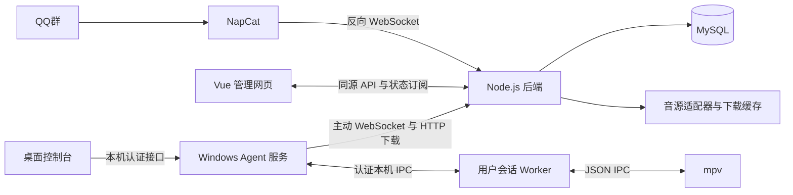

# 凤凰鸣架构

前端、后端与 Agent 为三个独立项目。NapCat 部署在 QQ 登录电脑，前后端与 MySQL 部署在 Linux 公网服务器，Agent 部署在 Windows 播放电脑。NapCat 和 Agent 均主动连接后端，播放电脑不需要公网 IP。



## 模块边界

| 目录 | 责任 |
| --- | --- |
| `frontend/src` | Vue 3 / Naive UI 管理页面、状态订阅、日志查看 |
| `backend/src/auth` | 管理员登录、会话与请求来源检查 |
| `backend/src/core` | 数据存储、设备、播放区、设置、事件与日志 |
| `backend/src/onebot` | QQ 卡片与链接解析、NapCat 接口、群菜单与指令 |
| `backend/src/music` | 音源适配、资料补全、安装、进程管理和镜像测速 |
| `backend/src/media` | 完整音频校验、缓存、预热和分段下载 |
| `backend/src/policies` | 可选歌词内容审核 |
| `backend/src/queues` | 点歌、歌单、黑名单、插队额度与队列操作 |
| `backend/src/playback` | 调度、持久命令、播放状态和断线协调 |
| `backend/src/transport` | NapCat 与 Agent 的独立 WebSocket 入口 |
| `agent/src/service.ts` | 联网、租约、持久事件、本机控制与紧急制动 |
| `agent/src/worker.ts` / `mpv.ts` | 用户会话播放器、进度、音频输出和恢复 |
| `agent/src/download.ts` | 本机缓存、分段下载与 SHA-256 校验 |
| `agent/scripts` | Windows 服务与登录任务、桌面控制台和独立程序打包 |

共享协议以 `backend/src/contracts/index.ts` 为维护入口，前端与 Agent 带独立副本。修改后运行根目录 `npm run sync:contracts`，各项目运行时不依赖其他目录。

## QQ 群与设备

NapCat 的账号通过 `get_login_info` 读取，群通过 `get_group_list` 同步。后台绑定账号、群与播放区，每区一台有效设备；多个群可以共享播放区队列。机器人使用 NapCat 登录账号。

群内 `#menu` 显示指令；点歌、查看队列、插队、取消和歌单走相同业务规则。暂停、继续、切歌与音量等管理操作校验群管理员身份。设备凭证注册时显示一次，后端保存哈希；NapCat 使用独立 Token。

后端采用 NestJS、Prisma 与 MySQL，关键状态变化放在事务中，网络下载在事务外执行。部署单个后端进程；不依赖 Redis。`file` 存储用于本地开发，不自动迁移到 MySQL。

## 点歌与取源

```text
群消息与去重 → 群绑定与用户规则 → 卡片或链接解析
             → 原平台 ID 与资料补全 → 黑名单与可选内容审核
             → 区域队列 → 预热与完整音频缓存
             → 播放前复核 → 派发设备命令 → mpv 开始与终态回报
```

原分享地址及歌曲 ID 优先。原音频下载或完整性校验失败后，才按配置顺序调用备用音源；名称搜索可选，默认关闭，候选需匹配歌曲身份。试听片段不作为完整歌曲。当前支持范围和平台差异见 [音源说明](music-sources.md)。

go-music-dl、musicdl、Meting、api-enhanced、GD Studio 均在后端取源。前两种由管理员点击安装，保存配置和启动服务不会自动安装。平台 Cookie 留在后端，Agent 只接收项目缓存的下载票据。音频保持源文件编码，控制走 WebSocket，文件走 HTTP。

预热仅处理通过审核的排队任务，默认每区 3 首、全局并发 2。后端默认 4 路下载，核对 Range 与文件版本，失败后回退完整下载；Agent 分段下载缓存后检查最终 SHA-256。详见 [下载说明](downloads.md)。

## 队列与策略

队列状态为 `review / queued / preparing / dispatching / playing`，终态为 `completed / failed / skipped / cancelled`。命令 ACK 只代表设备接收，`playback.started` 才代表播放器实际开始。

普通队列按先后顺序播放。插队进入优先队列，不打断当前歌曲；连续两首优先后让普通队列获得机会。每日额度 `0–999` 按 `Asia/Shanghai` 日期计数，同一用户跨群共享，消费与退款记录持久化。歌单入队仍检查用户上限与黑名单。

人员黑名单按 QQ 身份，歌曲黑名单按平台与歌曲 ID，支持全局、群和播放区范围。点歌、准备及派发阶段复核规则，AI 放行不覆盖明确禁用。

可选 AI 审核歌名、歌手与歌词，不分析实际听感。缺少歌词、模型超时或返回错误时按配置允许或待审核；密钥从后端环境变量读取，审核规则在后台配置。歌词与卡片内容作为待审数据传入。

## Agent 与恢复

NSSM 管理 LocalService 联网服务，计划任务在播放用户登录时启动 Worker。mpv 在用户会话运行并跟随 Windows 默认音频输出。服务在线但 Worker / mpv 未就绪时，后端暂停派发。

命令包含设备、播放区、连接 epoch、任务身份与有效期。重复命令不重复播放，旧连接和过期命令不能覆盖当前任务。Agent 重连报告真实播放快照；租约到期停止当前播放，不自行接下一首。

音频输出异常退出后，Worker 可从已校验缓存恢复已开始的当前歌曲，保留位置、音量和暂停状态。恢复过程检查任务身份、制动和租约，短时间重复失败则结束任务。网页和桌面控制台按 1 秒调整进度，跳转保留暂停状态；网页依据 Agent 声明的 seek 能力和实际时长开放控制，并绑定当前任务。桌面分别显示 Windows 服务、后端连接与播放器状态。紧急制动持久化，立即取消下载与停止受管播放，解除后不恢复旧任务。

本机控制接口仅监听回环地址并校验凭证，拒绝浏览器 Origin。协议细节见 [Agent 协议](agent-protocol.md)，运行日志见 [诊断说明](diagnostics.md)，测试边界见 [校验记录](verification.md)。
